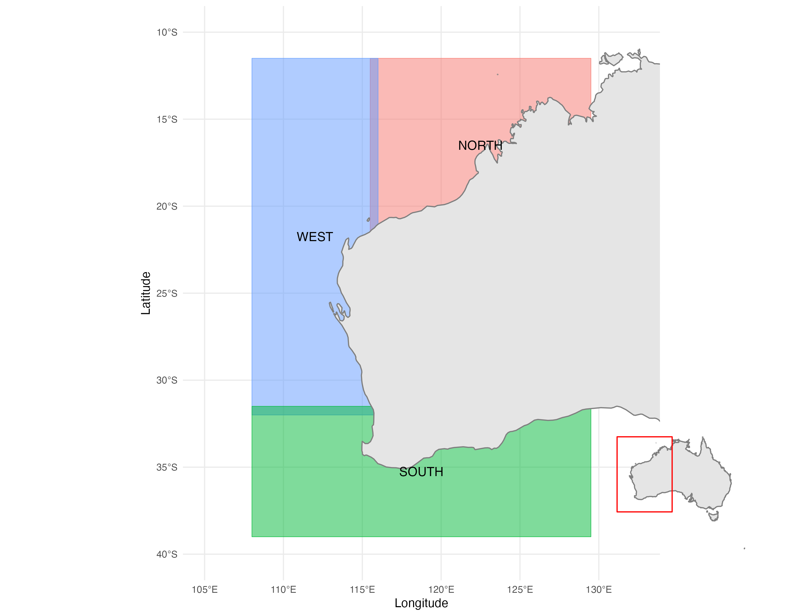

# dpird_climateResources

## Introduction
This repo provides a series of scripts and functions to:

(i) 100_Source_NetCDF_to_rds.R 
  - Initially save out source netcdf resources as .rds files (initially from CMPI6 and BRAN2020)
	- prevents all users storing similar files outside of a wider organisational location
	
(ii) 200_BRAN_data.R
  - the wrangling of these files (from their respective directories)
	- filtering further based on feature, time and spatial location
	- Generated data created --> replace this with your data
	- Process assigns Yearly, Monthly and/or Daily records of Bran features onto a dataset
	- Note: The limitation of this, if that life history (ie. lagged environmental conditions are not currently included)
	- Note: This could be achieved by producing a date-1 column in your dataset
	
(ii) 300_CMIP6_data.R
  - the wrangling of these files (from their respective directories)
	- filtering further based on feature, time and spatial location
	- Generated data created --> replace this with your data
	- Process assigns 3h record CMIP6 features onto a dataset


## Spatial Extraction for netcdf outputs
The current coding solution extracts netcdf outputs for the following spatial regions.




## Files
```plaintext
Parent Folder
├── 00_src
│   └── functions.R
├── 01_scripts
│   ├── 000_ImagesForExtents.R
│   ├── 100_Source_NetCDF_to_rds.R
│   ├── 200_BRAN_data.R
│   ├── 210_BRAN_dataAggregated.R
│   └── 300_CMIP6_data.R
├── 02_netCDFrds_BRAN
│   ├── rds_file1
│   ├── rds_file2
│   ├── ...
│   └── rds_fileN
└── 03_netCDFrds_CMIP6
    ├── rds_file1
    ├── rds_file2
    ├── ...
    └── rds_fileN
└── 04_visualisations
    └── image_spatialExtents.png
└── netCDFrds_BRAN_output
    ├── rds_file1 (dataframe, // process output) 
    ├── ...
    └── rds_fileN (dataframe, // process output)  
    └── yyyymmdd_BRAN_combinedTest.rds (generated data with yearly, monthly and/or daily features assigned)
└── netCDFrds_CMIP6_output
    ├── rds_file1 (dataframe, // process output) 
    ├── ...
    └── rds_fileN (dataframe, // process output)  
    └── yyyymmdd_CMIP6_combinedTest.rds (generated data with wind and wave assigned to 3h window)
```